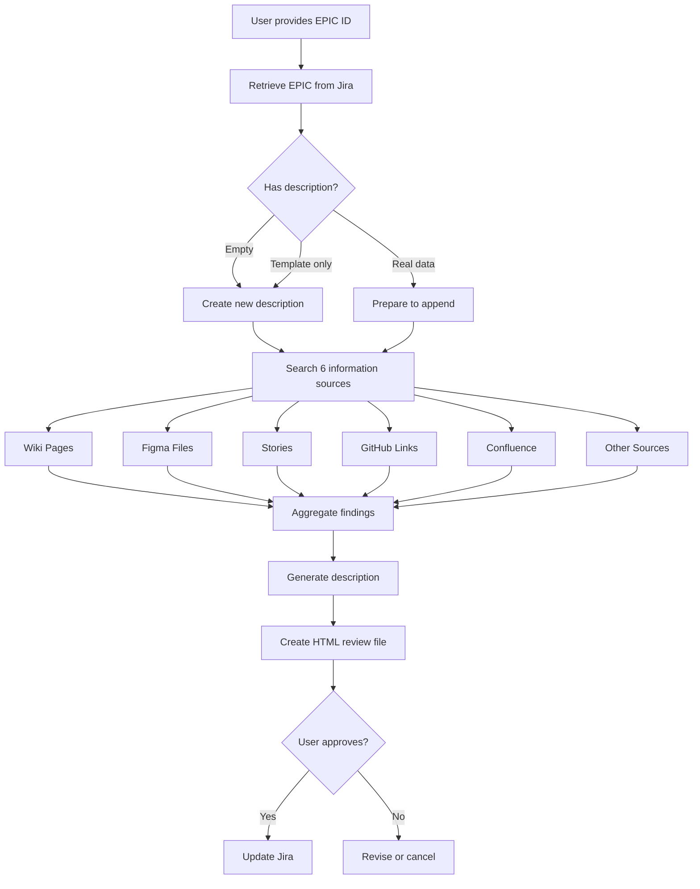

# EPIC Description Automation - Complete Documentation

## Overview

This documentation set provides a comprehensive system for automatically generating professional, standardized EPIC descriptions for Adobe Stock Jira tickets by intelligently gathering information from multiple sources.

## Documentation Files

### 1. **EPIC_Description_Generation_Prompt.md** (Main Prompt)
The complete, detailed prompt that defines the entire process for EPIC description generation.

**Contains:**
- Quick reference guide
- Information gathering methodology (6 sources)
- Template structure from STK-68219
- Good example from STK-129540
- HTML output template
- Rules and error handling
- Quality standards
- Process flow diagrams

**Use this when:** You need to understand the complete process or reference specific rules

### 2. **EPIC_Description_Usage_Examples.md** (Practical Guide)
Real-world examples and scenarios showing how to use the system.

**Contains:**
- Basic usage examples (single EPIC, bulk EPICs)
- Real-world scenarios with different information availability
- Example HTML review files
- Command examples
- Error handling examples
- Best practices and tips
- Troubleshooting guide

**Use this when:** You want to see practical examples or troubleshoot issues

## Quick Start

### Prerequisites
- Access to Jira (STK project)
- Access to Confluence (Adobe Wiki)
- Access to Corp GitHub
- Figma access (optional but recommended)
- MCP connections configured

### Basic Workflow



### Simple Commands

**Single EPIC:**
```
Generate description for STK-130000
```

**Bulk EPICs:**
```
Generate descriptions for all Q4 2025 EPICs without descriptions
```

**Update Existing:**
```
Update description for STK-130000 with new information
```

## Key Features

### ✅ Intelligent Information Gathering
- Searches 6+ sources automatically
- Follows priority order (Wiki → Figma → Stories → GitHub → Confluence → Other)
- Aggregates findings intelligently
- Reports what was found and what's missing

### ✅ Template-Based Structure
- Follows STK-68219 template exactly
- Maintains consistency across all EPICs
- Includes all required sections

### ✅ Smart Description Handling
- Detects empty templates vs. real data
- Appends to existing descriptions (never overwrites real data)
- Replaces empty templates completely
- Adds separator when appending

### ✅ Professional Output
- Adobe Brand Guidelines styling
- HTML review files for easy comparison
- Clear information source tracking
- Confidence indicators

### ✅ Bulk Processing
- Process multiple EPICs consistently
- Individual HTML files per EPIC
- Summary report for bulk operations
- Error handling with continue-on-error option

## Reference EPICs

### STK-68219 - Template EPIC
**Purpose:** This is the official template structure that all EPICs should follow

**Key Sections:**
- EPIC INFORMATION table
- Sign Offs tracking
- Team assignments

**When to reference:** To understand the required structure and sections

### STK-129540 - Example EPIC
**Purpose:** This is an example of a well-written description with good detail

**Key Features:**
- Clear business value articulation
- Specific success metrics
- Strategic context
- Implementation scope
- Professional language

**When to reference:** To understand the level of detail and professionalism expected

## Important Rules

### ⚠️ Critical Rules

1. **Never Assume Data**
   - If information isn't found, leave it blank or state "Information not found"
   - Do NOT fabricate business value, metrics, or requirements
   - Do NOT use generic placeholder text

2. **Always Review Before Updating**
   - Generate HTML review file first
   - Get explicit user permission before updating Jira
   - Show current vs. proposed description clearly

3. **Preserve Existing Information**
   - Never overwrite real data in existing descriptions
   - Append new information with clear separation
   - Only replace if description is empty template

4. **Follow Template Structure**
   - Use STK-68219 template exactly
   - Maintain consistency across all EPICs
   - Include all required sections (even if empty)

5. **Maintain Quality Standards**
   - Professional, business-focused language
   - Clear, concise descriptions
   - Quantifiable metrics where possible
   - Proper references and links

## Output Files

### HTML Review Files
**Format:** `EPIC_Description_Review_STK-XXXXX.html`

**Contains:**
- EPIC metadata (ID, title, status, priority, team, date)
- Information sources with status (✓ found / ✗ not found)
- Confidence indicator (High/Medium/Low)
- Current description
- Proposed description
- Summary of changes table
- Action area for approval

### Bulk Summary Reports
**Format:** `EPIC_Description_Bulk_Summary.html`

**Contains:**
- List of all EPICs processed
- Status for each (Success/Partial/No Info Found/Error)
- Quick stats (sources found per EPIC)
- Links to individual review files

## Success Metrics

Track these metrics to measure the effectiveness of the automation:

- **Coverage:** % of EPICs with complete descriptions
- **Quality:** % of EPICs meeting all template sections
- **Consistency:** % of EPICs following STK-68219 structure
- **Time Saved:** Hours saved vs. manual description writing
- **Information Density:** Average number of sources found per EPIC

## Troubleshooting

### Common Issues

**Issue:** "No information found for EPIC"
- **Cause:** EPIC has no linked Stories, wiki pages, or documentation
- **Solution:** Add documentation sources or create template for future population

**Issue:** "Authentication failed"
- **Cause:** MCP connections or credentials expired
- **Solution:** Update Jira token, check MCP status

**Issue:** "Description seems incomplete"
- **Cause:** Limited information in available sources
- **Solution:** This is expected - the system never fabricates data. Add sources manually and re-run.

**Issue:** "Wrong template structure"
- **Cause:** System may have used old template
- **Solution:** Verify STK-68219 template is current and referenced correctly

## Best Practices

### For Product Managers
1. Ensure PRDs are linked in "mentioned in" section
2. Attach Figma files to EPICs
3. Create Stories with detailed descriptions before running generation
4. Review HTML files thoroughly before approving

### For Epic Leads
1. Run generation early in EPIC lifecycle
2. Re-run as more information becomes available
3. Use for bulk updates at quarter boundaries
4. Ensure team members are filled in template

### For Engineering Managers
1. Verify technical documentation is in Confluence
2. Ensure Stories have GitHub PR links
3. Review architecture sections for accuracy
4. Add technical constraints to Confluence docs

## Future Enhancements

Potential improvements to consider:
- [ ] Auto-detection of duplicate/similar EPICs
- [ ] Integration with PRD templates
- [ ] Automatic Story description summarization
- [ ] GitHub commit message analysis
- [ ] Slack thread integration for context
- [ ] Auto-population of team members from recent activity
- [ ] Smart suggestion of related EPICs
- [ ] Analytics integration for automatic success metrics

## Support & Feedback

For issues or suggestions:
1. Check the troubleshooting section in Usage Examples
2. Review the complete prompt for edge cases
3. Verify MCP connections are active
4. Ensure you have proper access to all data sources

## Document Version

**Version:** 1.0  
**Last Updated:** October 17, 2025  
**Author:** Vivek Jain  
**Status:** Production Ready

---

## File Structure

```
/Users/vivekjain/.cursor/Test/
├── EPIC_DESCRIPTION_README.md              (This file - Overview)
├── EPIC_Description_Generation_Prompt.md   (Complete prompt specification)
└── EPIC_Description_Usage_Examples.md      (Practical examples and scenarios)
```

## Quick Links

- **Template EPIC:** [STK-68219](https://jira.corp.adobe.com/browse/STK-68219)
- **Example EPIC:** [STK-129540](https://jira.corp.adobe.com/browse/STK-129540)
- **STK Project:** [Adobe Stock Jira](https://jira.corp.adobe.com/projects/STK)
- **Confluence:** [Adobe Stock Wiki](https://wiki.corp.adobe.com/display/adobestock/)

---

© 2025 Adobe. All rights reserved.


